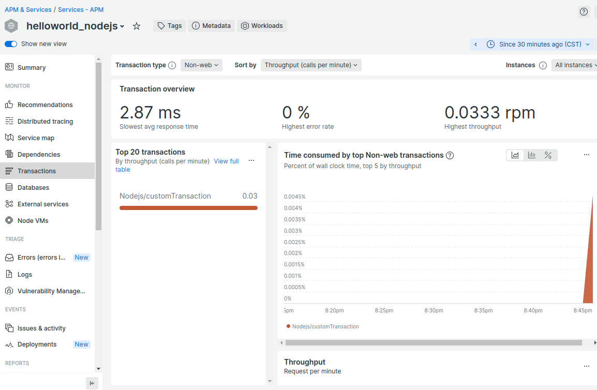
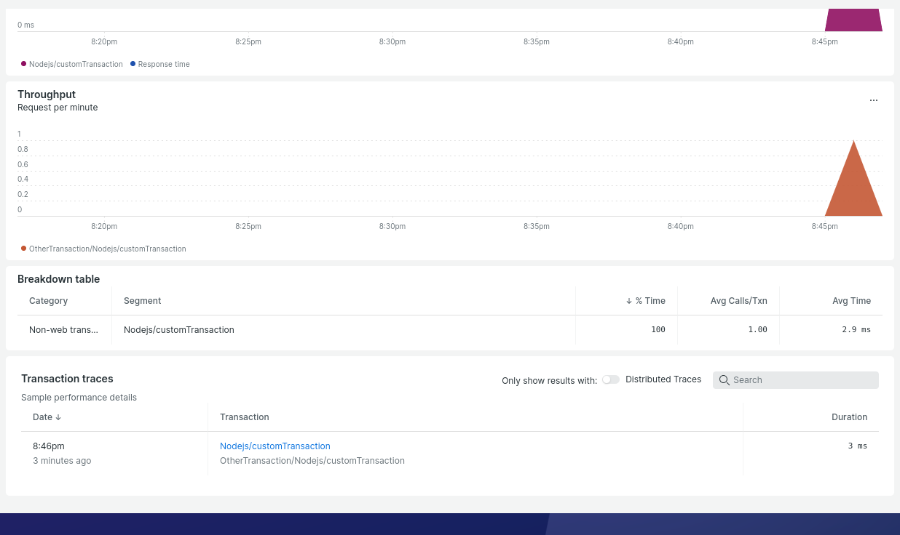
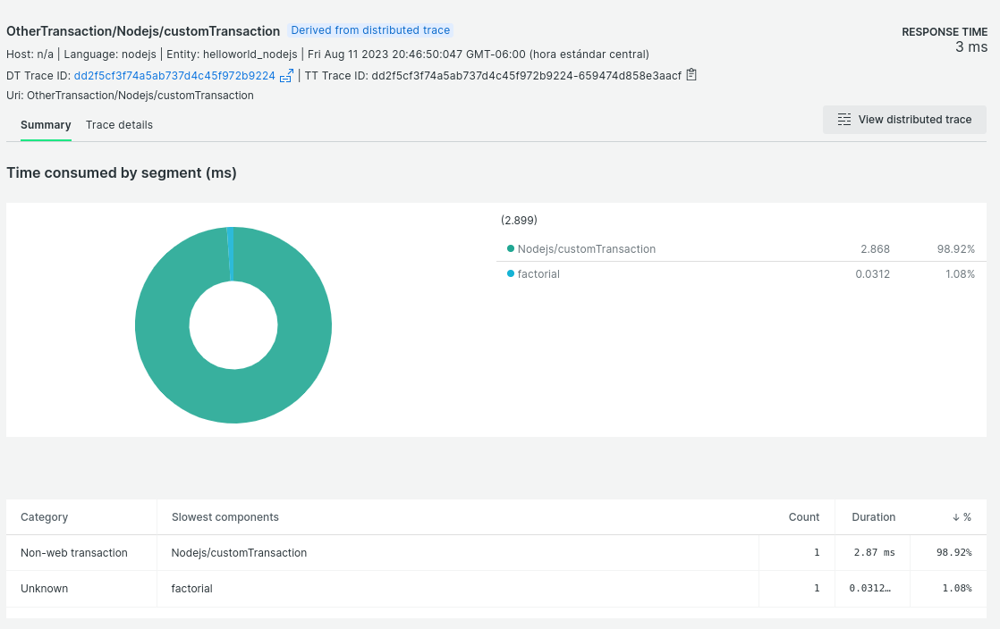

# New Relic custom instrumentation

## Quick instructions
1. clone the 'newrelic' branch of this repository
2. edit the package.json file and add your New Relic key
3. build the container: 'npm run docker:build'
4. run the application inside the container: 'npm run docker:run'
5. make as many visits to http://localhost:3000/ as possible, you can use the ab command: 'ab -n 200 http://localhost:3000/'
6. go to the New Relic console and search 'helloworld_nodejs' application in the APM instrumentations, go to the transactions section and search customTransaction inside non-web transactions
7. delete the container: 'npm run docker:stop'

## New Relic console output

APM View 

Transaction View 

Inside of a sampled transaction 

# original documentation

For the original documentation please consult this file on the master branch

